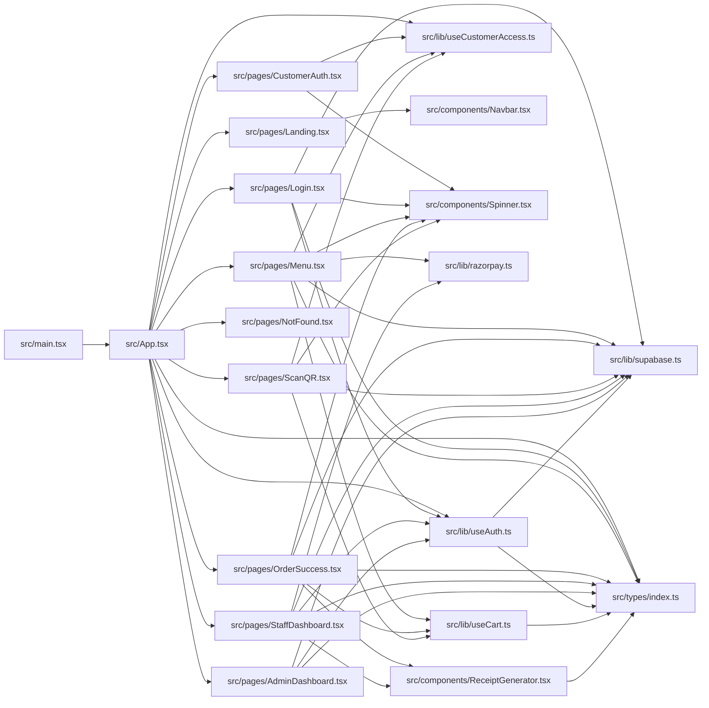

# Code Review Graph

This graph captures internal TypeScript/TSX import dependencies inside `src/`.
Use it during review to understand impact radius when changing a page, hook, or shared module.

## Dependency Graph

## Review Focus Hotspots

1. `src/types/index.ts` is a shared dependency for pages, hooks, and receipt generation.
2. `src/lib/supabase.ts` is the data-access root used by auth and multiple pages.
3. `src/lib/useAuth.ts` is consumed by routing and admin/staff/login flows.
4. `src/lib/useCustomerAccess.ts` influences route guards and customer journey pages.
5. `src/components/Spinner.tsx` is shared across customer, auth, and order flows.
